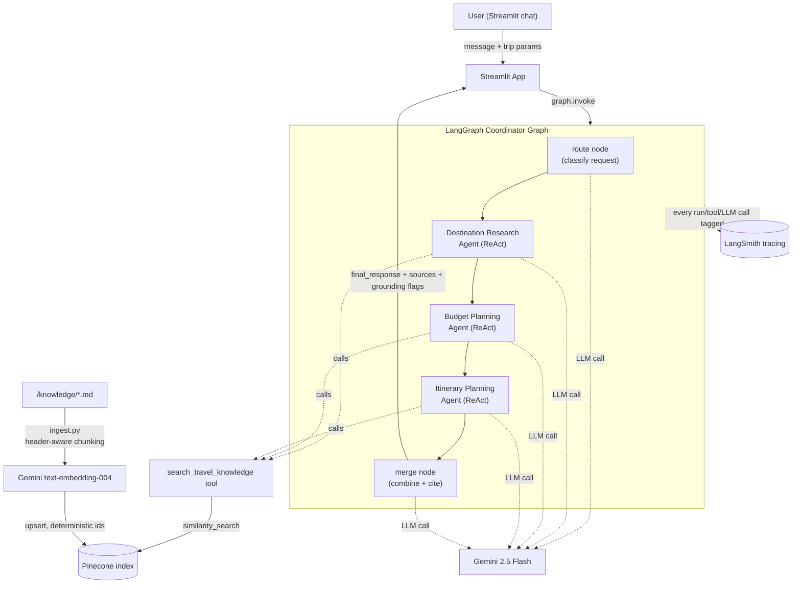

# Travel Recommendation Agents

A multi-agent travel recommendation system built with **LangChain** + **LangGraph**,
answering strictly from a curated markdown knowledge base (`/knowledge`) via
Retrieval-Augmented Generation over **Pinecone**, powered by **Google Gemini**,
with every run traced in **LangSmith**, and a **Streamlit** chat UI on top.

The system never invents facts, prices, or recommendations. If the knowledge
base doesn't cover something, the agents say so explicitly.

## Architecture



**Flow of a request:**
1. The Streamlit app appends the user's message (plus sidebar trip parameters)
   to the conversation state and calls the compiled LangGraph graph.
2. The **route** node (an LLM classifier with structured output) decides which
   of the three specialists are relevant to this turn.
3. Each relevant specialist runs as its own **ReAct agent** bound to the
   `search_travel_knowledge` tool -- it decides for itself when and how many
   times to query the knowledge base (this is what makes it *agentic* RAG,
   not a hardcoded similarity call glued in front of a prompt). A specialist
   that isn't needed this turn is a no-op pass-through (no LLM call).
4. The **Itinerary** agent runs after **Budget**, and is given the Budget
   agent's cost breakdown as context, so the itinerary respects it.
5. The **merge** node combines whichever specialists ran into one response.
   If only one specialist ran, its text is passed through verbatim (no LLM
   rephrasing, so nothing ungrounded can be introduced at this step).
6. Every specialist returns its retrieved chunks' source metadata
   (`file > section`) and a grounding-check result; the UI shows both.

## Anti-hallucination design

Grounding is enforced at three layers:

1. **System prompts** (`src/agents/prompts.py`) -- every agent (Destination
   Research, Budget Planning, Itinerary Planning) is instructed to only use
   `search_travel_knowledge` tool results, never its own training knowledge
   about these places, and to explicitly say when the knowledge base doesn't
   have what's needed rather than estimating or guessing.
2. **Agentic retrieval, not naive RAG** -- the retriever is a LangChain tool
   the agent calls itself (can re-query with a different phrasing if the
   first search comes up short), rather than a fixed chunk of context spliced
   into the prompt ahead of time.
3. **Grounding check** (`src/tools/grounding.py`) -- after each specialist
   answers, a lightweight word-overlap check compares every substantial
   sentence in the answer against the text of the chunks that were actually
   retrieved. Sentences with low overlap are flagged (not deleted or
   blocked -- shown to the user as "possibly ungrounded") in the Streamlit
   UI's "Sources & grounding check" expander. This is a cheap heuristic, not
   a second LLM judge call, so it adds no real latency.

The **merge** node never adds new facts -- when more than one specialist
contributed, an LLM call reorganizes/rephrases their existing text into one
response, but is explicitly instructed not to introduce anything new; when
only one specialist ran, its output is passed through unchanged.

## Project structure

```
knowledge/                  Markdown knowledge base, one file per destination
src/
  config.py                 Centralized .env-backed settings
  ingestion/
    loader.py                Header-aware markdown chunking
    vectorstore.py            Pinecone index + Gemini embeddings setup
    ingest.py                 Ingestion / re-ingestion CLI (idempotent upserts)
  tools/
    retriever_tool.py         Agentic RAG tool (search_travel_knowledge)
    grounding.py               Lexical-overlap grounding check
  agents/
    prompts.py                 Shared grounding rules + per-agent prompts
    base.py                    Shared ReAct agent builder / runner
    destination_agent.py
    budget_agent.py
    itinerary_agent.py
  graph/
    state.py                   Shared LangGraph state schema
    coordinator.py              Route + merge nodes
    build.py                    Graph assembly
app/
  streamlit_app.py            Chat UI
tests/
  test_retriever.py
  test_agent_node.py
  test_grounding.py
Makefile
requirements.txt
.env.example
```

## Setup

Requires [`uv`](https://docs.astral.sh/uv/) (used to pin the project to
Python 3.12, since the LangChain/Pinecone/Streamlit ecosystem is best-tested
there).

```bash
make setup
```

This creates `.venv` and installs everything in `requirements.txt`.

Then copy the example env file and fill in your keys:

```bash
cp .env.example .env
```

Required in `.env`:
- `GOOGLE_API_KEY` -- Gemini chat + embeddings ([get one here](https://aistudio.google.com/apikey))
- `PINECONE_API_KEY` -- Pinecone
- `INDEX_NAME` -- a **dedicated** Pinecone index name for this project; don't
  point it at an index used by another app, since embedding dimensions and
  content would collide
- `LANGSMITH_API_KEY`, `LANGSMITH_PROJECT` -- LangSmith tracing (use a
  project name specific to this app so its traces are easy to find)

### Build the Pinecone index

```bash
make ingest
```

This loads every `knowledge/*.md` file, splits it by `#`/`##` heading (so a
chunk never straddles two unrelated sections), embeds each chunk with
Gemini's `text-embedding-004`, and upserts into Pinecone with metadata
(`source`, `destination`, `section`) attached. The Pinecone index is created
automatically on first run if `INDEX_NAME` doesn't exist yet.

Chunk ids are a deterministic hash of `(source file, section, content)`, so
running `make ingest` again after editing a markdown file **updates that
chunk in place** rather than creating a duplicate.

### Run the app

```bash
make app
```

Opens the Streamlit chat UI at `http://localhost:8501`. Set trip parameters
(destination, days, travelers, budget, interests, pace) in the sidebar --
they're passed into the agent pipeline alongside your chat messages.

### Run tests

```bash
make test
```

## Viewing traces in LangSmith

With `LANGSMITH_TRACING=true` and a valid `LANGSMITH_API_KEY` in `.env`, every
graph run, agent LLM call, and tool call is traced automatically. Open
[smith.langchain.com](https://smith.langchain.com), select the project named
by `LANGSMITH_PROJECT`, and you'll see:
- One trace per chat turn, named `coordinator_graph`
- Nested runs for `coordinator_route`, each specialist agent (tagged
  `agent:destination_research` / `agent:budget_planning` /
  `agent:itinerary_planning`), their individual `search_travel_knowledge`
  tool calls, and `coordinator_merge`

## Adding a new destination and re-indexing

1. Add a new file under `knowledge/`, e.g. `knowledge/goa.md`, following the
   same section outline as `knowledge/kashmir.md` (numbered `#` sections,
   `##` subsections for things like attractions and best-time-to-visit
   seasons).
2. Re-run ingestion:
   ```bash
   make ingest
   ```
   New chunks are added; if you also edited or removed sections in an
   *existing* file, use `make reingest` instead, which prunes vectors for
   chunks that no longer exist:
   ```bash
   make reingest
   ```
3. Restart the Streamlit app (or just ask about the new destination in an
   existing session -- retrieval reads from Pinecone live, no app restart
   needed for new content to become searchable).

## Known limitations

- **Grounding check is lexical, not semantic** -- it flags sentences with
  low word overlap against retrieved chunks. It can miss a paraphrased
  hallucination that reuses the same vocabulary, and can false-positive on
  short connective sentences. Treat its flags as a hint for the user to
  double-check, not a guarantee.
- **No conversation checkpointing across app restarts** -- chat history
  lives in Streamlit `session_state`; refreshing the browser or restarting
  the app clears it. LangGraph's checkpointer support could persist this if
  needed.
- **Routing is a single LLM classification per turn** -- for an ambiguous or
  multi-part message, the router may under- or over-select specialists. It
  errs toward including a specialist when unsure, so worst case is an extra
  (grounded) section rather than a missing one.
- **No cross-destination cost comparison** -- the Budget agent reasons about
  one destination's figures at a time; comparing costs across destinations
  would require the coordinator to fan out to multiple Budget agent calls,
  which isn't implemented.
- **Pinecone serverless index only** -- `ensure_index` creates a serverless
  index (`ServerlessSpec`); pod-based indexes aren't handled.
- **Knowledge base coverage is uneven** -- `kashmir.md` covers all 15
  sections of the outline; `kerala.md` and `andamanandnicobar.md` cover a
  subset; `meghalaya.md` is partial. Agents will correctly report missing
  data for sections that don't exist yet rather than fill gaps.
